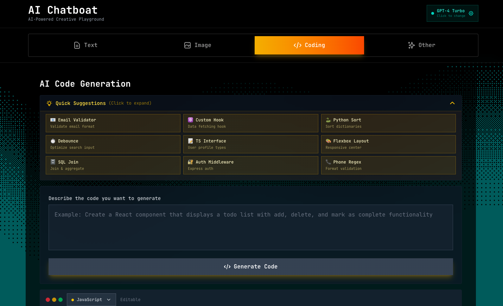

# Nano Banana Pro - Free AI Creative Playground

Nano Banana Pro is a cutting-edge AI creative platform built with Next.js 16 and Tailwind CSS 4. It serves as a unified interface for multiple top-tier AI models, allowing users to generate text, code, and images, as well as edit images using advanced AI tools.



## 🚀 Features

### 🤖 Multi-Model AI Support
Seamlessly switch between the world's best AI models:
- **OpenAI**: GPT-4 Turbo, GPT-4o, GPT-3.5 Turbo
- **Google**: Gemini 2.0 Flash (Experimental), Gemini 1.5 Pro, Gemini 1.5 Flash
- **Anthropic**: Claude 3.5 Sonnet, Claude 3 Opus, Claude 3 Haiku
- **xAI**: Grok 2 Vision
- **Meta**: Llama 3.1
- **Stability AI**: Stable Diffusion XL

### 🎨 Creative Tools
- **Text-to-Image Generation**: Create stunning visuals using DALL-E 3 and other supported models.
- **AI Image Editing**: Upload images or provide URLs to edit and transform them using AI.
- **Image Combiner**: Merge capabilities to blend images creatively.
- **Fullscreen Viewer**: Immersive viewing experience for generated assets.

### 💻 Developer Features
- **Intelligent Code Generation**: Generate code in Python, JavaScript, TypeScript, Go, Rust, and more.
- **Code Conversion**: Automatically convert code between different programming languages.
- **Syntax Highlighting**: Beautifully formatted code blocks with language detection.

### 🛠️ UX/UI
- **Modern Interface**: Sleek, responsive design built with Tailwind CSS v4.
- **Local History**: Your generations are saved locally in your browser for easy access.
- **Keyboard Shortcuts**: Power-user shortcuts for quick generation and navigation.

## 📋 Prerequisites

Ensure you have the following installed:
- **Node.js**: v18.17 or higher
- **pnpm** (preferred) or npm/yarn

## 🛠️ Installation

1.  **Clone the repository**
    ```bash
    git clone https://github.com/yourusername/ai-chatbot.git
    cd ai-chatbot
    ```

2.  **Install dependencies**
    ```bash
    pnpm install
    # or
    npm install
    ```

## ⚙️ Configuration

To use the AI features, you must configure the API keys. 

1.  **Create a `.env` file** in the root directory (you can copy `.env.example` if available, or use the template below).
2.  **Add your API keys**. You only need to add keys for the providers you want to use. The app automatically detects available providers.

```env
# Google Gemini API Key
# Get yours at: https://aistudio.google.com/app/apikey
GEMINI_API_KEY=your_gemini_key_here

# OpenAI API Keys (Used for GPT models and DALL-E)
# Get yours at: https://platform.openai.com/api-keys
OPENAI_API_KEY=your_openai_key_here

# Anthropic Claude API Key
# Get yours at: https://console.anthropic.com/
ANTHROPIC_API_KEY=your_anthropic_key_here

# xAI Grok API Key
# Get yours at: https://console.x.ai/
XAI_API_KEY=your_xai_key_here

# Meta Llama API Key (via providers like Replicate or Together AI if configured)
LLAMA_API_KEY=your_llama_key_here

# Stability AI API Key
# Get yours at: https://platform.stability.ai/
STABILITY_API_KEY=your_stability_key_here
```

> [!NOTE]
> The application checks for these keys at runtime. If a key is missing, the corresponding models will simply be unavailable in the UI.

## 🏃‍♂️ Running the App

Start the development server:

```bash
pnpm dev
# or
npm run dev
```

Open [http://localhost:3000](http://localhost:3000) with your browser to see the result.

## 🏗️ Technology Stack

- **Framework**: [Next.js 16](https://nextjs.org/) (App Router)
- **Styling**: [Tailwind CSS 4](https://tailwindcss.com/)
- **AI SDK**: [Vercel AI SDK](https://sdk.vercel.ai/docs)
- **UI Components**: [Radix UI](https://www.radix-ui.com/) & [Lucide React](https://lucide.dev/)
- **Validation**: [Zod](https://zod.dev/)

## ⌨️ Keyboard Shortcuts

- `⌘/Ctrl + Enter` : Generate
- `⌘/Ctrl + C` : Copy to clipboard
- `⌘/Ctrl + D` : Download image
- `⌘/Ctrl + U` : Use image as input
- `Esc` : Close viewer

## 📄 License

This project is licensed under the MIT License - see the [LICENSE](LICENSE) file for details.
